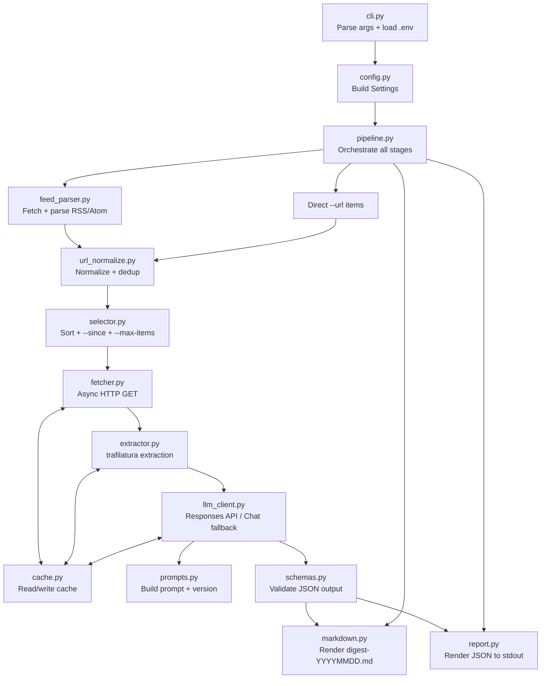
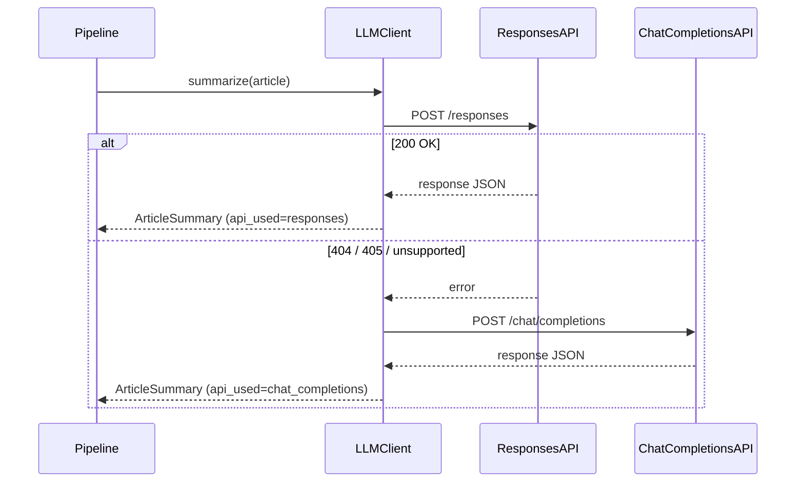
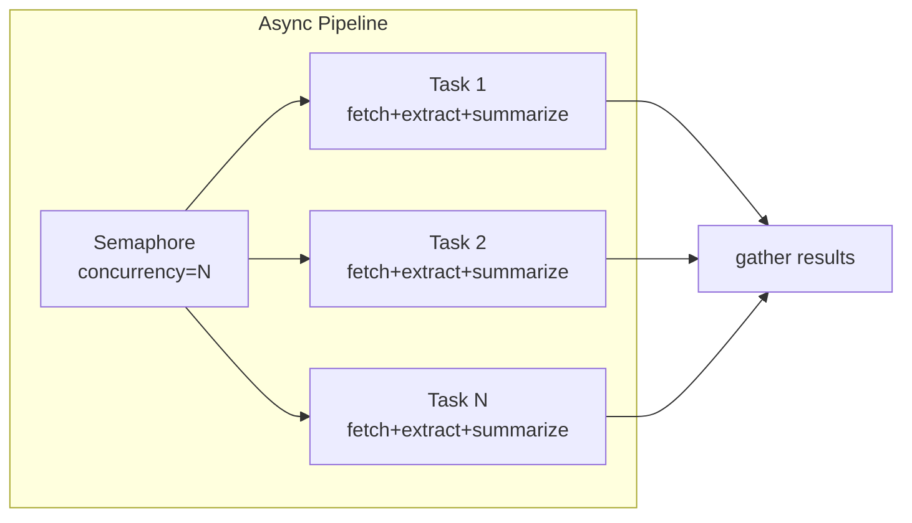
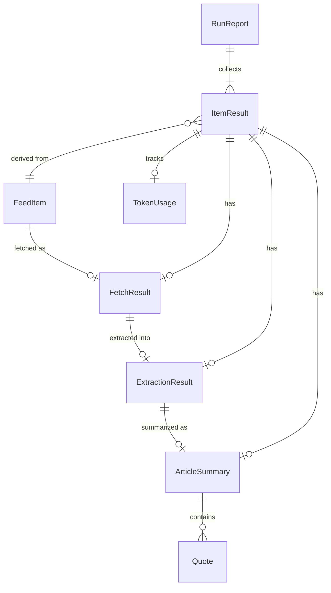

# Distill-Feed -- Architecture Document

- **Project**: `distill-feed`
- **Based on**: [PRD](PRD.md)
- **Last updated**: 2026-02-15

---

## 1. Tech Stack and Dependencies

| Category | Choice | Rationale |
|---|---|---|
| Language | Python 3.12+ | f-strings, `type` unions, `tomllib` stdlib, modern asyncio |
| CLI framework | **Click** | Mature, composable, decorator-based; fewer transitive deps than Typer |
| HTTP client | **httpx** (async) | First-class async, timeout/redirect/retry hooks, HTTP/2 optional |
| Feed parsing | **feedparser** | De-facto standard for RSS/Atom in Python |
| Content extraction | **trafilatura** | Best accuracy for readability-style extraction; actively maintained |
| LLM SDK | **openai** (official) | Native `base_url` override, supports both Responses and Chat Completions APIs |
| Data models | **Pydantic v2** | Validation, JSON serialization, `BaseSettings` for config |
| Env loading | **python-dotenv** | Load `.env` before config resolution |
| Async runtime | **asyncio** (stdlib) | Built-in; `asyncio.run()` at CLI boundary |
| Testing | **pytest** + **pytest-asyncio** + **respx** | Async test support; `respx` for httpx mocking |
| Linting / Format | **ruff** | Fast, single-tool lint + format |

### Dependency summary (`pyproject.toml` extras)

```
[project]
requires-python = ">=3.12"
dependencies = [
    "click>=8.1",
    "httpx>=0.27",
    "feedparser>=6.0",
    "trafilatura>=1.12",
    "openai>=1.60",
    "pydantic>=2.9",
    "pydantic-settings>=2.5",
    "python-dotenv>=1.0",
]

[project.optional-dependencies]
dev = [
    "pytest>=8.0",
    "pytest-asyncio>=0.24",
    "respx>=0.22",
    "ruff>=0.8",
]
```

---

## 2. Project Layout

```
distill-feed/
  pyproject.toml              # Package metadata, deps, scripts entry point
  README.md                   # Quick-start and usage
  .env.example                # Documented env var template
  src/
    distill_feed/
      __init__.py             # Package version
      cli.py                  # Click CLI: `distill-feed digest`
      config.py               # Pydantic BaseSettings for all options
      models.py               # Core domain data models
      pipeline.py             # Top-level orchestration
      cache.py                # File-based cache (URL-hash keyed)
      ingestion/
        __init__.py
        feed_parser.py        # RSS/Atom feed fetching + parsing
        url_normalize.py      # URL normalization + deduplication
        selector.py           # Sort, --since filter, --max-items cap
      extraction/
        __init__.py
        fetcher.py            # Async HTTP GET with retry/backoff
        extractor.py          # trafilatura content extraction
      summarization/
        __init__.py
        llm_client.py         # Responses API + Chat Completions fallback
        prompts.py            # Prompt templates + version registry
        schemas.py            # Pydantic models for LLM JSON output
      output/
        __init__.py
        markdown.py           # Render digest-YYYYMMDD.md
        report.py             # Render JSON run report to stdout
  tests/
    conftest.py               # Shared fixtures
    test_cli.py
    test_feed_parser.py
    test_url_normalize.py
    test_selector.py
    test_fetcher.py
    test_extractor.py
    test_llm_client.py
    test_markdown.py
    test_report.py
    test_pipeline.py
    fixtures/                 # Sample RSS XML, HTML pages, LLM responses
  docs/
    PRD.md
    ARCHITECTURE.md
```

**Why `src/` layout?** Prevents accidental imports from the working directory; enforces that tests import the installed package, catching packaging bugs early.

---

## 3. Architecture Diagram

### 3.1 End-to-End Pipeline



### 3.2 LLM Fallback Strategy



### 3.3 Concurrency Model



---

## 4. Data Models

All models use **Pydantic v2** `BaseModel` for validation and serialization.

### 4.1 Ingestion Models

```python
from datetime import date, datetime
from enum import Enum
from pydantic import BaseModel, Field, HttpUrl


class SourceType(str, Enum):
    FEED = "feed"
    DIRECT = "direct"


class FeedItem(BaseModel):
    """A candidate article discovered from a feed or direct URL."""
    url: str
    normalized_url: str
    title: str | None = None
    feed_title: str | None = None
    published: datetime | None = None
    updated: datetime | None = None
    author: str | None = None
    source_type: SourceType

    @property
    def sort_date(self) -> datetime | None:
        return self.published or self.updated
```

### 4.2 Extraction Models

```python
class FetchResult(BaseModel):
    """Result of HTTP-fetching an article URL."""
    url: str
    status_code: int | None = None
    html: str | None = None
    error: str | None = None
    duration_ms: float = 0.0
    from_cache: bool = False


class ExtractionResult(BaseModel):
    """Result of readability extraction on fetched HTML."""
    url: str
    title: str | None = None
    content: str = ""          # cleaned main text
    content_length: int = 0
    quality_score: float = 0.0  # text / markup ratio
    error: str | None = None
    duration_ms: float = 0.0
    from_cache: bool = False
```

### 4.3 Summarization Models

```python
class Quote(BaseModel):
    quote: str
    context: str


class ArticleSummary(BaseModel):
    """Structured summary returned by LLM (must match prompt schema)."""
    title: str
    one_sentence: str
    summary_bullets: list[str]
    key_takeaways: list[str]
    why_it_matters: list[str]
    notable_quotes: list[Quote] = Field(default_factory=list)
    tags: list[str] = Field(default_factory=list)
    confidence: float = 0.0
```

### 4.4 Pipeline / Report Models

```python
class ItemStatus(str, Enum):
    SELECTED = "selected"
    SUMMARIZED = "summarized"
    SKIPPED = "skipped"
    FAILED = "failed"


class TokenUsage(BaseModel):
    prompt_tokens: int = 0
    completion_tokens: int = 0
    total_tokens: int = 0


class ItemResult(BaseModel):
    """Full processing record for a single article."""
    status: ItemStatus
    url: str
    title: str | None = None
    feed_title: str | None = None
    date: datetime | None = None
    skip_reason: str | None = None
    fetch: FetchResult | None = None
    extraction: ExtractionResult | None = None
    summary: ArticleSummary | None = None
    error: str | None = None
    token_usage: TokenUsage | None = None
    timings: dict[str, float] = Field(default_factory=dict)   # stage -> ms


class LLMApiUsed(str, Enum):
    RESPONSES = "responses"
    CHAT_COMPLETIONS = "chat_completions"


class RunInputs(BaseModel):
    feed_count: int
    url_count: int
    feeds: list[str] = Field(default_factory=list)
    urls: list[str] = Field(default_factory=list)


class RunSelection(BaseModel):
    total_selected: int
    since: datetime | date | None = None
    max_items: int | None = None


class RunLLM(BaseModel):
    base_url: str
    model: str
    api_used: LLMApiUsed | None = None
    prompt_version: str


class RunReport(BaseModel):
    """Machine-readable run report (--json output)."""
    run_id: str
    timestamp: datetime
    inputs: RunInputs
    selection: RunSelection
    llm: RunLLM
    items: list[ItemResult]   # includes selected|summarized|skipped|failed
    success_count: int = 0
    failure_count: int = 0
    skip_count: int = 0
```

### 4.5 Model Relationships



---

## 5. Module Responsibilities

### 5.1 `cli.py` -- CLI Entry Point

- Define Click group `distill_feed` with subcommand `digest`.
- Declare all CLI options per PRD section 4.1.
- Parse `--feeds-file` / `--urls-file` as one URL per line, ignoring blank lines and `#` comments.
- Load `.env` via `python-dotenv` (override=False) before Click processes defaults.
- Build a `Config` object from merged CLI args + env vars.
- Call `pipeline.run(config)` inside `asyncio.run()`.
- Always `sys.exit(0)` regardless of pipeline outcome.
- If `--json`, write `RunReport` JSON to stdout after pipeline completes.

### 5.2 `config.py` -- Configuration

- `Config` extends `pydantic_settings.BaseSettings`.
- Fields map 1:1 to CLI options, with env var aliases (e.g. `DISTILL_FEED_API_KEY`).
- Precedence: CLI flag > environment variable > `.env` > default.
- Sensitive fields (`api_key`) use `SecretStr`.
- `api_key` may be omitted in CLI args when provided by environment / `.env`.
- Validation of API key presence is runtime-conditional: required only when summarization calls are attempted, not for `--dry-run`.
- Validation: `base_url` must be a valid URL; `temperature` must be 0.0-2.0; `concurrency` must be >= 1.

### 5.3 `ingestion/feed_parser.py` -- Feed Parsing

- `async def parse_feeds(feed_urls: list[str], timeout: float) -> list[FeedItem]`
- Fetch each feed URL via httpx, parse with `feedparser`.
- Extract: `feed_title`, item `title`, `link`, `published`, `updated`, `author`.
- Return list of `FeedItem` with `source_type=FEED`.

### 5.4 `ingestion/url_normalize.py` -- URL Normalization

- `def normalize_url(url: str) -> str`
  - Lowercase scheme + host.
  - Remove trailing slash (unless path is `/`).
  - Strip common tracking query params (`utm_*`, `ref`, `source`).
  - Sort remaining query params for deterministic comparison.
- `def deduplicate(items: list[FeedItem]) -> list[FeedItem]`
  - Group by `normalized_url`; keep first occurrence (feed items preferred over direct).

### 5.5 `ingestion/selector.py` -- Ranking and Filtering

- `def select_items(items, since, max_items) -> tuple[list[FeedItem], list[SkippedItem]]`
- Sort: dated items first (newest to oldest), then undated items (stable sort by `normalized_url`).
- Apply `--since`: exclude dated items older than threshold; keep undated.
- Apply `--max-items`: truncate to global cap.
- Return selected items + list of skipped items with reasons.

### 5.6 `extraction/fetcher.py` -- HTTP Fetching

- `async def fetch_article(url, client, config, cache) -> FetchResult`
- Check cache first; return cached HTML if fresh.
- HTTP GET with:
  - `User-Agent: distill-feed/{version}`
  - Follow redirects (httpx default).
  - Timeout from config.
  - Retry transient errors (429, 5xx) with exponential backoff (max 3 attempts).
- Store successful HTML in cache.
- Never raise; return `FetchResult` with error field on failure.

### 5.7 `extraction/extractor.py` -- Content Extraction

- `def extract_content(html, fallback_title) -> ExtractionResult`
- Use `trafilatura.extract()` with `output_format="txt"` (or optional markdown).
- Fallback title: if trafilatura returns no title, use the feed/item title.
- Compute `quality_score = len(extracted_text) / max(len(html), 1)`.
- Never raise; return `ExtractionResult` with error field on failure.

### 5.8 `summarization/llm_client.py` -- LLM Client

- `class LLMClient`:
  - Holds `openai.AsyncOpenAI` instance configured with `base_url` + `api_key`.
  - Tracks `api_used: LLMApiUsed` (set after first successful call).
  - `async def summarize(text, metadata, config) -> tuple[ArticleSummary, TokenUsage]`
    1. Build prompt via `prompts.build_prompt(...)`.
    2. Try Responses API (`client.responses.create(...)`).
    3. On 404/405/not-supported error, fallback to Chat Completions (`client.chat.completions.create(...)`).
    4. Parse JSON output via `schemas.parse_summary(raw_text)`.
    5. On invalid JSON: one repair attempt (send raw output back to model asking for fix).
    6. On second failure: raise `SummaryParseError`.
  - Latch fallback: once Chat Completions succeeds, skip Responses for remaining items in the run.

### 5.9 `summarization/prompts.py` -- Prompt Templates

- `PROMPT_VERSION = "1.0"`
- `def build_prompt(metadata: dict, text: str, preset: str, max_input_chars: int) -> str`
  - Truncate `text` to `max_input_chars` (preserving instruction block).
  - Inject metadata (title, url, feed, date).
  - Append JSON schema contract.
  - Return the full prompt string.
- Preset registry: `{"default": DEFAULT_TEMPLATE}` (extensible for future presets).

### 5.10 `summarization/schemas.py` -- Output Schema Validation

- `def parse_summary(raw: str) -> ArticleSummary`
  - Extract JSON from model output (handle markdown fences, leading text).
  - Validate against `ArticleSummary` Pydantic model.
  - Raise `SummaryParseError` if invalid.

### 5.11 `output/markdown.py` -- Markdown Digest Writer

- `def render_digest(items: list[ItemResult], config, report) -> str`
- Read-friendly article-only output: include only `status=summarized` items with valid summaries.
- Omit run-level header/tail metadata from markdown; run metadata stays in JSON report/logs.
- Per-article sections use stable plain-text blocks per PRD section 8.2.
- `def write_digest(content: str, out_base: str, run_date: date) -> Path`
  - Compute filename: `{stem}-{YYYYMMDD}{suffix}` from `out_base`.
  - Write UTF-8 file and return path.

### 5.12 `output/report.py` -- JSON Run Report

- `def build_report(item_records, config, run_id, timestamp, api_used, skipped_items) -> RunReport`
- `def emit_report(report: RunReport) -> None`
  - Serialize to JSON, write to stdout.
  - Output is one JSON object with stable keys matching PRD section 9.
  - `items` contains all statuses (`selected|summarized|skipped|failed`) with skip/failure reasons when present.
  - Human logs remain on stderr.

### 5.13 `cache.py` -- File-Based Cache

- `class FileCache`:
  - `cache_dir: Path` (default `~/.cache/distill-feed/`).
  - Key scheme: `sha256(url + discriminator)` where discriminator allows separate namespaces (html, text, summary).
  - `def get(namespace, url) -> str | None`
  - `def put(namespace, url, data: str) -> None`
  - Summary cache keys also include `prompt_version` so prompt changes invalidate old summaries.
  - Optional size limit for HTML cache (skip caching if HTML > threshold).

### 5.14 `pipeline.py` -- Orchestration

- `async def run(config: Config) -> RunReport`
  1. Generate `run_id` (UUID4) and `timestamp` (UTC now).
  2. **Ingest**: parse feeds + collect direct URLs.
  3. **Normalize + dedup**.
  4. **Select**: sort, filter by `--since`, cap by `--max-items`; retain skipped items + reasons.
  5. If `--dry-run`: build report with `selected` and `skipped` item records, render article-only digest (may be empty), return (no LLM client initialization or calls).
  6. **Process** each selected item concurrently (bounded by semaphore):
     - fetch -> extract -> summarize (or mark failed at any stage).
  7. Merge processed item records with skipped item records into final report payload.
  8. **Output**: render markdown digest for summarized items, optionally emit JSON report.
  9. Return `RunReport`.

---

## 6. Data Flow

Step-by-step walkthrough of a typical `distill-feed digest` invocation:

```
1. CLI parses args, loads .env, builds Config
                    |
2. pipeline.run(config) starts
                    |
3. Feed URLs --(httpx + feedparser)--> list[FeedItem]
   Direct URLs ----(wrap)-----------> list[FeedItem]
                    |
4. Inputs from `--feeds-file` / `--urls-file` are expanded (ignore blank + `#` comment lines)
   and merged with repeatable CLI flags.
                    |
5. All FeedItems --(normalize_url)--> deduplicated list[FeedItem]
                    |
6. Deduplicated --(selector)--> selected list[FeedItem] + skipped list
   (sort by date, apply --since, apply --max-items)
                    |
7. If --dry-run: render article-only digest (may be empty) + report (selected + skipped records), return
                    |
8. For each selected item (concurrently, semaphore-bounded):
   a. fetch_article(url) --> FetchResult
      - cache check -> hit: return cached HTML
      - cache miss: HTTP GET -> store in cache
   b. extract_content(html) --> ExtractionResult
      - cache check -> hit: return cached text
      - cache miss: trafilatura -> store in cache
   c. summarize(text, metadata) --> ArticleSummary + TokenUsage
      - cache check (url + prompt_version) -> hit: return cached
      - cache miss: LLM call (Responses, fallback Chat) -> store
   d. Build ItemResult(status=summarized | failed)
                    |
9. Collect all ItemResult and append skipped item records
                    |
10. render_digest(items, config, report) --> write digest-YYYYMMDD.md
                    |
11. If --json: build_report(...) --> emit JSON to stdout
                    |
12. sys.exit(0)
```

---

## 7. Configuration Hierarchy

Resolution order (highest priority first):

```
CLI flag  >  Environment variable  >  .env file  >  Default
```

### Environment variable mapping

| CLI Flag | Env Var | Default |
|---|---|---|
| `--base-url` | `DISTILL_FEED_BASE_URL` | `https://api.openai.com/v1` |
| `--api-key` | `DISTILL_FEED_API_KEY` | (none -- optional at parse time; required for live LLM calls) |
| `--model` | `DISTILL_FEED_MODEL` | `gpt-4o-mini` |
| `--temperature` | `DISTILL_FEED_TEMPERATURE` | `0.2` |
| `--max-output-tokens` | `DISTILL_FEED_MAX_OUTPUT_TOKENS` | `1024` |
| `--timeout` | `DISTILL_FEED_TIMEOUT` | `30` |
| `--concurrency` | `DISTILL_FEED_CONCURRENCY` | `4` |
| `--cache-dir` | `DISTILL_FEED_CACHE_DIR` | `~/.cache/distill-feed/` |
| `--out` | `DISTILL_FEED_OUT` | `./digest.md` |

### `.env` loading rules

1. Look for `.env` in the current working directory.
2. Call `dotenv.load_dotenv(override=False)` -- existing env vars are never overwritten.
3. This happens **before** Pydantic `BaseSettings` resolves values.

### API key requirement semantics

- `--api-key` is optional when `DISTILL_FEED_API_KEY` is provided by environment or `.env`.
- If neither CLI nor env provides an API key:
  - `--dry-run` remains valid (no LLM calls).
  - non-dry-run marks attempted summarization items as failed with a clear missing-credentials error in report/logs, while still exiting with code 0.

---

## 8. LLM Client Strategy

### 8.1 API selection strategy

For OpenAI-compatible providers, the `LLMClient` attempts the **Responses API** first and latches to **Chat Completions** on failure:

```
State machine:
  INIT --> try Responses API
    success --> RESPONSES_CONFIRMED (use Responses for all remaining)
    fail (404/405/unsupported) --> try Chat Completions
      success --> CHAT_CONFIRMED (use Chat for all remaining)
      fail --> raise (item marked as failed)
```

Once the API path is determined (on the first successful call), the client latches and skips the probe for all subsequent items in the same run. The latched value is recorded as `api_used` in the run report.

For Google Gemini native API (`base_url` host `generativelanguage.googleapis.com` and non-OpenAI-compatible path), the client uses:

```
POST {base_url}/models/{model}:generateContent?key={api_key}
```

and records `api_used=chat_completions` in the run report for schema compatibility.

### 8.2 Request construction

**Responses API:**
```python
response = await client.responses.create(
    model=config.model,
    input=prompt,
    temperature=config.temperature,
    max_output_tokens=config.max_output_tokens,
    text={"format": {"type": "json_object"}},
)
```

**Chat Completions API:**
```python
response = await client.chat.completions.create(
    model=config.model,
    messages=[{"role": "user", "content": prompt}],
    temperature=config.temperature,
    max_tokens=config.max_output_tokens,
    response_format={"type": "json_object"},
)
```

**Gemini native API (`v1beta`):**
```python
response = await httpx_client.post(
    f"{config.base_url}/models/{config.model}:generateContent",
    params={"key": config.api_key},
    json={
        "contents": [{"role": "user", "parts": [{"text": prompt}]}],
        "generationConfig": {
            "temperature": config.temperature,
            "maxOutputTokens": config.max_output_tokens,
            "responseMimeType": "application/json",
        },
    },
)
```

### 8.3 JSON repair

If the model returns invalid JSON:
1. Extract the raw text output.
2. Send a one-shot repair prompt: "The following is invalid JSON. Fix it and return only valid JSON: {raw}".
3. Parse the repair response.
4. If still invalid, mark the item as `failed` with a `json_parse_error`.

### 8.4 Token budgeting

- Compute a hard cap for input text: `max_input_chars` (configurable, default ~12000 chars).
- Truncation strategy: keep the first `max_input_chars` characters of extracted text, append `[...truncated]`.
- The system/instruction portion of the prompt is always preserved in full.

---

## 9. Caching Design

### 9.1 Storage structure

```
{cache_dir}/
  html/
    {sha256(url)}.html        # raw fetched HTML
  text/
    {sha256(url)}.txt         # extracted article text
  summary/
    {sha256(url + prompt_version)}.json  # LLM summary JSON
  meta/
    {sha256(url)}.json        # extraction metadata
```

### 9.2 Cache key computation

```python
import hashlib

def cache_key(url: str, discriminator: str = "") -> str:
    raw = url + discriminator
    return hashlib.sha256(raw.encode()).hexdigest()
```

### 9.3 Invalidation

- **HTML cache**: no automatic expiry in v1; user can delete `cache_dir` to refresh.
- **Text cache**: same as HTML (derived from HTML, so invalidation is coupled).
- **Summary cache**: keyed by `prompt_version`, so prompt changes naturally invalidate.
- Future: optional TTL-based expiry, `--no-cache` flag.

### 9.4 Size limits

- HTML files larger than 5 MB are not cached (fetched each time).
- Cache directory total size is not managed in v1 (user responsibility).

---

## 10. Concurrency Model

### 10.1 Architecture

The pipeline uses `asyncio.gather()` with an `asyncio.Semaphore` to bound parallelism:

```python
async def process_items(items: list[FeedItem], config: Config) -> list[ItemResult]:
    semaphore = asyncio.Semaphore(config.concurrency)

    async def process_one(item: FeedItem) -> ItemResult:
        async with semaphore:
            result = await fetch_extract_summarize(item, config)
            return result

    return await asyncio.gather(
        *(process_one(item) for item in items)
    )
```

### 10.2 Shared resources

- A single `httpx.AsyncClient` instance is shared across all tasks (connection pooling).
- The `LLMClient` instance is shared (thread-safe via async; latched API state is set once).
- The `FileCache` instance is shared (file I/O is run via `asyncio.to_thread` to avoid blocking).

### 10.3 Default concurrency

- Default: `4` concurrent tasks.
- Configurable via `--concurrency`.
- Feed parsing itself is also parallelized (fetch multiple feeds concurrently) using the same semaphore.

---

## 11. Error Handling

### 11.1 Design principles

- **Never crash the CLI.** All errors are caught at the pipeline level.
- **Always exit 0.** Errors are surfaced in JSON report and/or stderr logs.
- **Per-item isolation.** A failure in one article does not affect others.
- **Never log secrets.** API keys are masked in all log output.

### 11.2 Error categories

| Stage | Error Type | Handling |
|---|---|---|
| Feed fetch | Network error, parse error | Log warning; skip feed; continue with others |
| Article fetch | Timeout, HTTP error, DNS failure | `FetchResult.error` set; item status=failed |
| Extraction | Extraction failure, empty content | `ExtractionResult.error` set; item status=failed |
| LLM call | API error, timeout, rate limit | Retry once; on second failure: item status=failed |
| JSON parse | Invalid model output | One repair attempt; then item status=failed |
| File I/O | Permission denied, disk full | Log error to stderr; exit 0 with partial results |

### 11.3 Error surfacing

```
stderr (logging)  <-- always, for human/agent log consumption
--json report     <-- full structured status + error info per item
digest.md         <-- summarized article content only
```

---

## 12. Testing Strategy

### 12.1 Test pyramid

```
Unit tests (fast, isolated)
  |-- ingestion: feed_parser, url_normalize, selector
  |-- extraction: extractor (mocked HTML input)
  |-- summarization: schemas, prompts
  |-- output: markdown, report
  |-- cache
  |
Integration tests (slower, mocked HTTP/LLM)
  |-- fetcher with respx-mocked httpx
  |-- llm_client with mocked openai responses
  |-- pipeline end-to-end with all mocks
  |
CLI tests
  |-- Click test runner (CliRunner)
  |-- Verify exit code always 0
  |-- Verify file output naming convention
```

### 12.2 Key fixtures

- `fixtures/sample_rss.xml` -- minimal valid RSS 2.0 feed with 3 items.
- `fixtures/sample_atom.xml` -- minimal Atom feed.
- `fixtures/sample_article.html` -- realistic blog post HTML.
- `fixtures/llm_response_valid.json` -- valid `ArticleSummary` JSON.
- `fixtures/llm_response_invalid.json` -- malformed JSON for repair testing.

### 12.3 Testing conventions

- All tests in `tests/` directory, files prefixed with `test_`.
- Use `pytest-asyncio` for async test functions.
- Use `respx` to mock `httpx` calls (HTTP fetch + feed fetch).
- Use `unittest.mock.patch` to mock `openai` SDK calls.
- Activate the test virtualenv before running:

```bash
source ~/workspace/buildingai/bin/activate
pytest tests/ -v
```

---

## 13. Milestone-to-Module Mapping

### M0: CLI skeleton + config/env + markdown writer (no LLM)

| File | Work |
|---|---|
| `pyproject.toml` | Project metadata, deps, `[project.scripts]` entry |
| `src/distill_feed/__init__.py` | Version string |
| `src/distill_feed/cli.py` | Click group + `digest` subcommand with all options |
| `src/distill_feed/config.py` | `Config` BaseSettings with all fields + `.env` loading |
| `src/distill_feed/models.py` | All Pydantic models (FeedItem through RunReport) |
| `src/distill_feed/output/markdown.py` | Digest renderer (article-only sections) |
| `src/distill_feed/output/report.py` | JSON report builder + emitter |
| `src/distill_feed/pipeline.py` | Skeleton orchestration (no fetch/extract/summarize yet) |
| `tests/test_cli.py` | CLI smoke tests via CliRunner |
| `tests/test_markdown.py` | Digest rendering tests |

### M1: URL fetch + readability extraction + LLM summarize (direct URLs)

| File | Work |
|---|---|
| `src/distill_feed/extraction/fetcher.py` | Async HTTP GET with timeout + basic retry |
| `src/distill_feed/extraction/extractor.py` | trafilatura extraction + quality score |
| `src/distill_feed/summarization/llm_client.py` | Responses API + Chat fallback + JSON repair |
| `src/distill_feed/summarization/prompts.py` | Default prompt template + version |
| `src/distill_feed/summarization/schemas.py` | Parse + validate LLM JSON output |
| `src/distill_feed/pipeline.py` | Wire fetch -> extract -> summarize for `--url` items |
| `tests/test_fetcher.py` | Mocked HTTP tests |
| `tests/test_extractor.py` | Extraction with sample HTML |
| `tests/test_llm_client.py` | Mocked LLM API tests |

### M2: RSS ingestion + global ranking + --since + --max-items

| File | Work |
|---|---|
| `src/distill_feed/ingestion/feed_parser.py` | RSS/Atom fetch + parse via feedparser |
| `src/distill_feed/ingestion/url_normalize.py` | Normalize + dedup |
| `src/distill_feed/ingestion/selector.py` | Sort + since filter + max-items cap |
| `src/distill_feed/pipeline.py` | Integrate feed parsing + selection into pipeline |
| `tests/test_feed_parser.py` | Feed parsing with sample XML |
| `tests/test_url_normalize.py` | URL normalization edge cases |
| `tests/test_selector.py` | Sorting, filtering, capping logic |

### M3: Caching + retry/backoff + concurrency + --json report

| File | Work |
|---|---|
| `src/distill_feed/cache.py` | FileCache implementation |
| `src/distill_feed/extraction/fetcher.py` | Add exponential backoff + cache integration |
| `src/distill_feed/pipeline.py` | Add semaphore-based concurrency |
| `src/distill_feed/output/report.py` | Full JSON report with timings + token usage |
| `tests/test_pipeline.py` | End-to-end integration test |

### M4: Hardening

| File | Work |
|---|---|
| `src/distill_feed/ingestion/url_normalize.py` | Advanced dedup (more tracking params, fragments) |
| `src/distill_feed/extraction/extractor.py` | Fallback extractors, better quality heuristics |
| `src/distill_feed/summarization/llm_client.py` | Provider-specific quirk handling |
| `src/distill_feed/cache.py` | Size management, optional TTL |
| All tests | Edge cases, stress tests |

---

## 14. Security and Privacy

- **API keys**: stored as `SecretStr` in config; never logged, never cached, never written to digest.
- **Logging**: `--verbose` increases log detail but redacts keys; article text is not logged unless explicitly enabled.
- **Cache**: stores only public content (HTML, extracted text, summaries); no secrets.
- **Network**: User-Agent identifies the tool; no hidden tracking.
- **Digest output**: article-only summaries; run-level LLM metadata lives in JSON report and never includes `api_key`.
